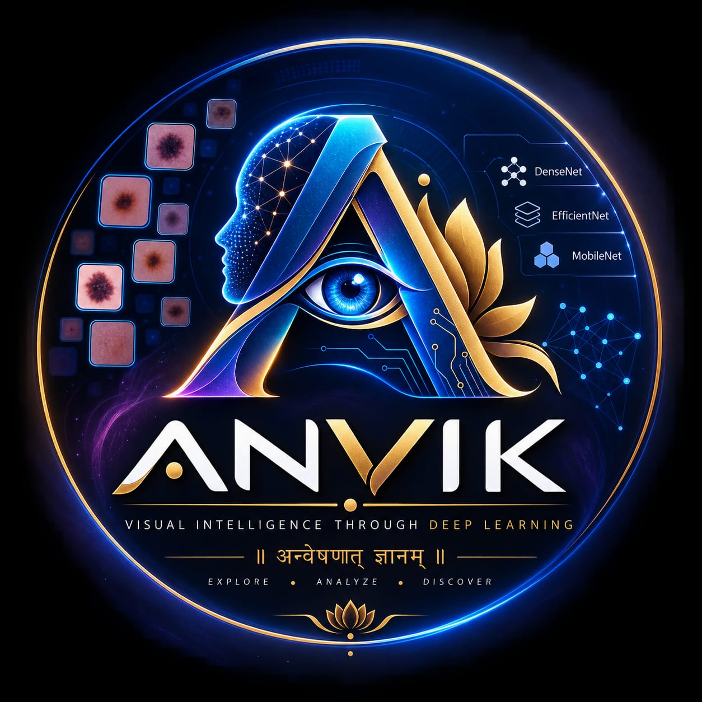

# 🩺 ANVIK AI

### AI-Assisted Skin Disease Classification & Analysis Platform

<p align="center">
  
</p>

<h3 align="center">
  Intelligent • Research-Driven • Responsible AI
</h3>

<p align="center">
  <strong>Anvik AI</strong> is a deep-learning based skin disease classification platform that combines
  <strong>DenseNet121</strong>, interactive visual analytics, and an
  <strong>LLM-powered assistance layer</strong> to provide image-based predictions and contextual information.
</p>

<p align="center">


</p>

---

## 🧬 About Anvik AI

**Anvik AI** is an applied computer vision research project focused on skin disease image classification.

The system uses a transfer-learning based **DenseNet121** model to analyze an uploaded skin image and estimate the most probable class among the supported disease categories.

The application then transforms the model output into an accessible interface containing:

* Predicted condition
* Highest model confidence
* Class-wise probability distribution
* Risk-oriented informational indicators
* Disease information
* AI-generated contextual guidance
* Prevention-oriented suggestions
* Professional-care recommendations
* Downloadable prediction reports

The core philosophy of Anvik is:

> **AI should assist understanding — not replace clinical judgment.**

---

# ✨ Key Features

### 🔬 Deep Learning Classification

* DenseNet121 transfer-learning architecture
* 224 × 224 image input
* Four-class classification
* TensorFlow/Keras inference
* Cached model loading for faster application startup

### 📊 Model Analytics

* Highest-confidence prediction
* Confidence percentage
* Complete class probability distribution
* Interactive charts
* Prediction metrics
* Risk-oriented visual indicators

### 🤖 AI Assistance

Integration with the Groq API provides natural-language contextual assistance such as:

* Condition explanation
* General characteristics
* Prevention suggestions
* Skin-care guidance
* When professional consultation may be appropriate
* Warning messages for potentially concerning cases

### 🩺 Responsible Health UX

Anvik explicitly separates:

```text
Machine Learning Prediction
          ↓
AI Explanation
          ↓
Human / Clinical Decision
```

The AI output is not presented as a medical diagnosis.

### 📄 Report Generation

The application can generate downloadable reports containing:

* Uploaded image
* Predicted class
* Confidence
* Probability distribution
* Disease information
* AI-generated guidance
* Timestamp
* Medical disclaimer

---

# 🧠 Research Objective

The primary objective of Anvik AI is to investigate whether transfer-learning based convolutional neural networks can provide useful image-level classification of skin disease categories.

The project specifically focuses on:

1. Comparing multiple CNN architectures.
2. Evaluating transfer-learning performance.
3. Selecting the strongest baseline model.
4. Integrating the selected model into an interactive application.
5. Visualizing prediction uncertainty.
6. Exploring LLM-assisted interpretation.
7. Maintaining responsible AI communication.

---

# 🏗️ System Architecture

```text
                         ┌───────────────────────┐
                         │       User Image      │
                         └───────────┬───────────┘
                                     │
                                     ▼
                         ┌───────────────────────┐
                         │ Image Preprocessing   │
                         │                       │
                         │ Resize: 224 × 224     │
                         │ RGB Conversion        │
                         │ Normalization         │
                         └───────────┬───────────┘
                                     │
                                     ▼
                         ┌───────────────────────┐
                         │      DenseNet121      │
                         │                       │
                         │ Transfer Learning     │
                         └───────────┬───────────┘
                                     │
                                     ▼
                         ┌───────────────────────┐
                         │ Class Probabilities   │
                         └───────────┬───────────┘
                                     │
                 ┌───────────────────┴───────────────────┐
                 │                                       │
                 ▼                                       ▼
      ┌──────────────────────┐              ┌──────────────────────┐
      │ Prediction Engine    │              │ Visualization Engine │
      │                      │              │                      │
      │ Top Class            │              │ Confidence Gauge     │
      │ Confidence           │              │ Probability Chart    │
      │ Risk Indicator       │              │ Class Distribution   │
      └──────────┬───────────┘              └──────────────────────┘
                 │
                 ▼
      ┌──────────────────────┐
      │     Groq AI Layer    │
      │                      │
      │ Explanation          │
      │ General Guidance     │
      │ Prevention           │
      │ Care Recommendation  │
      └──────────┬───────────┘
                 │
                 ▼
      ┌────────────────────────────┐
      │       ANVIK AI UI          │
      │                            │
      │ Prediction Dashboard       │
      │ Disease Information        │
      │ AI Assistant               │
      │ History                    │
      │ PDF Report                 │
      └────────────────────────────┘
```

---

# 🔬 Dataset

The project evaluates a skin disease dataset organized into four target categories.

| Class            | Category                          |
| ---------------- | --------------------------------- |
| Unknown / Normal | Normal or non-target skin         |
| Benign Tumors    | Benign skin growths               |
| Vascular Tumors  | Vascular-related lesions          |
| Skin Cancer      | Malignant skin-related conditions |

### Dataset Split

| Split      |    Images |
| ---------- | --------: |
| Training   |     3,393 |
| Validation |       587 |
| Testing    |       447 |
| **Total**  | **4,427** |

### Input Resolution

```text
224 × 224 × 3
```

Images are converted to RGB and normalized before inference.

---

# 🧪 Model Experiments

Three transfer-learning architectures were evaluated:

```text
DenseNet121
MobileNetV2
EfficientNetB0
```

All experiments used:

| Parameter         | Configuration |
| ----------------- | ------------- |
| Image Size        | 224 × 224     |
| Batch Size        | 32            |
| Optimizer         | Adam          |
| Learning Rate     | 0.0001        |
| Transfer Learning | Enabled       |
| Fine-Tuning       | Disabled      |

---

# 🏆 Experimental Results

## DenseNet121

| Metric              |     Result |
| ------------------- | ---------: |
| Training Accuracy   | **85.50%** |
| Validation Accuracy | **75.30%** |
| Test Accuracy       | **83.67%** |
| Test Loss           |  **0.414** |
| Precision           | **83.91%** |
| Recall              | **83.67%** |
| Weighted F1         | **83.29%** |
| Macro F1            | **77.28%** |

### Training Configuration

```text
Model              : DenseNet121
Training Images    : 3393
Validation Images  : 587
Testing Images     : 447
Image Size         : 224 × 224
Epochs             : 20
Batch Size         : 32
Optimizer          : Adam
Learning Rate      : 0.0001
Transfer Learning  : Yes
Fine-Tuning        : No
```

---

# MobileNetV2

| Metric              | Result |
| ------------------- | -----: |
| Training Accuracy   | 83.26% |
| Validation Accuracy | 73.76% |
| Test Accuracy       | 82.33% |
| Test Loss           |  0.495 |
| Precision           | 82.15% |
| Recall              | 82.33% |
| Weighted F1         | 81.77% |
| Macro F1            | 74.94% |

---

# EfficientNetB0

| Metric              | Result |
| ------------------- | -----: |
| Training Accuracy   | 83.76% |
| Validation Accuracy | 74.96% |
| Test Accuracy       | 82.55% |
| Test Loss           |  0.423 |
| Precision           | 82.00% |
| Recall              | 82.55% |
| Weighted F1         | 81.95% |
| Macro F1            | 74.32% |

---

# 📊 Model Comparison

| Rank | Architecture    | Test Accuracy |  Precision |     Recall | Weighted F1 |   Macro F1 |
| ---: | --------------- | ------------: | ---------: | ---------: | ----------: | ---------: |
|   🥇 | **DenseNet121** |    **83.67%** | **83.91%** | **83.67%** |  **83.29%** | **77.28%** |
|   🥈 | EfficientNetB0  |        82.55% |     82.00% |     82.55% |      81.95% |     74.32% |
|   🥉 | MobileNetV2     |        82.33% |     82.15% |     82.33% |      81.77% |     74.94% |

Based on the current experimental results, **DenseNet121 was selected as the deployment model** because it achieved the strongest overall performance across the evaluated metrics.

---

# 🔍 Why DenseNet121?

DenseNet121 introduces dense connectivity between layers.

Conceptually:

```text
Layer 1 ────────────────┐
                        │
Layer 2 ────────────────┼─────────► Layer 4
                        │
Layer 3 ────────────────┘
```

Instead of relying only on the immediately preceding layer, later layers can reuse feature representations from earlier layers.

This can improve:

* Feature propagation
* Gradient flow
* Feature reuse
* Representation efficiency

For skin images, useful representations may include:

* Lesion texture
* Color patterns
* Boundary structure
* Shape
* Local visual features

---

# 📸 Application Workflow

```text
1. Upload Image
       ↓
2. Image Validation
       ↓
3. Resize to 224 × 224
       ↓
4. Normalize
       ↓
5. DenseNet121 Inference
       ↓
6. Extract Class Probabilities
       ↓
7. Select Highest Probability
       ↓
8. Display Confidence
       ↓
9. Display Disease Information
       ↓
10. Generate AI-Assisted Guidance
       ↓
11. Generate Optional Report
```

---

# 🖥️ User Interface

The Anvik AI dashboard is designed around a modern clinical-inspired visual language.

### Dashboard

```text
┌─────────────────────────────────────────────────────────────┐
│                         ANVIK AI                             │
│       Intelligent Skin Disease Analysis Platform            │
├──────────────┬──────────────────────────────────────────────┤
│              │                                              │
│  Dashboard   │             Upload Skin Image                │
│              │                                              │
│  Prediction  │        ┌───────────────────────┐             │
│              │        │                       │             │
│  Disease     │        │     Image Preview     │             │
│  Information │        │                       │             │
│              │        └───────────────────────┘             │
│  History     │                                              │
│              │            [ Analyze Image ]                 │
│  About       │                                              │
│              │                                              │
└──────────────┴──────────────────────────────────────────────┘
```

After analysis:

```text
┌─────────────────────────────────────────────────────────────┐
│                    ANALYSIS RESULT                          │
├─────────────────────────────────────────────────────────────┤
│                                                             │
│  Predicted Condition                                        │
│                                                             │
│  Melanoma                                                   │
│                                                             │
│  Highest Confidence                                        │
│                                                             │
│  96.84%                                                     │
│                                                             │
│  ━━━━━━━━━━━━━━━━━━━━━━━━━━━━━━━━━━━━━━━                    │
│                                                             │
│  Probability Distribution                                   │
│                                                             │
│  Class A      ████████████████████ 96.84%                  │
│  Class B      ██                    1.72%                  │
│  Class C      █                     0.89%                  │
│  Class D                            0.55%                  │
│                                                             │
└─────────────────────────────────────────────────────────────┘
```

---

# 🤖 Groq AI Assistance

The LLM component is intentionally positioned **after** the image classifier.

```text
DenseNet121
     │
     ├── Predicted Class
     │
     └── Confidence
             │
             ▼
          Groq API
             │
             ▼
     Natural Language
        Assistance
```

The AI layer can provide:

### Explanation

A simple explanation of the predicted condition.

### General Guidance

General information related to the predicted category.

### Prevention

Potential preventive practices.

### Professional Care

Guidance about when professional medical evaluation may be appropriate.

### Important

The LLM output is informational and can contain errors. It must not be treated as a medical authority.

---

# 🚨 Responsible AI Design

Anvik AI follows a **human-in-the-loop** philosophy.

```text
AI Prediction
     ↓
AI Explanation
     ↓
Human Evaluation
     ↓
Professional Medical Decision
```

The application should never imply:

```text
AI Prediction = Medical Diagnosis
```

Instead:

```text
AI Prediction = Decision-Support Information
```

---

# ⚠️ Safety & Medical Disclaimer

> **Anvik AI is an experimental research and educational system. It is not a clinically validated diagnostic device and should not be used as a substitute for professional medical advice, diagnosis, or treatment.**

Model predictions can be affected by:

* Dataset limitations
* Image quality
* Lighting
* Camera characteristics
* Skin tone representation
* Dataset bias
* Distribution shift
* Class imbalance
* Previously unseen lesion characteristics

A high confidence score does not guarantee clinical correctness.

Users should consult a qualified dermatologist or healthcare professional for actual medical evaluation.

---

# 📄 Report Generation

Anvik can generate a structured prediction report containing:

```text
ANVIK AI
Skin Disease Analysis Report
──────────────────────────────

Image

Prediction:
Melanoma

Confidence:
96.84%

Probability Distribution:
Class A    96.84%
Class B     1.72%
Class C     0.89%
Class D     0.55%

Disease Information

AI-Assisted Guidance

Medical Disclaimer

Prediction Timestamp
```

---

# 🗂️ Project Structure

```text
Anvik-AI/
│
├── app.py
├── best_densenet121.keras
├── requirements.txt
├── README.md
├── LICENSE
├── .gitignore
├── .env.example
│
├── assets/
│   ├── anvik-logo.svg
│   └── screenshots/
│       ├── dashboard.png
│       ├── prediction.png
│       ├── probability.png
│       ├── ai-assistant.png
│       └── report.png
│
└── venv/
```

> `venv/`, `.env`, model checkpoints, generated reports, and temporary uploads should normally not be committed to Git.

---

# ⚙️ Installation

## 1. Clone the Repository

```bash
git clone https://github.com/<YOUR_USERNAME>/Anvik-AI.git
cd Anvik-AI
```

---

## 2. Create a Virtual Environment

### Windows

```powershell
python -m venv venv
venv\Scripts\activate
```

### Linux / macOS

```bash
python3 -m venv venv
source venv/bin/activate
```

---

## 3. Upgrade pip

```bash
python -m pip install --upgrade pip
```

---

## 4. Install Dependencies

```bash
pip install -r requirements.txt
```

Or:

```bash
pip install streamlit tensorflow pillow numpy pandas plotly groq python-dotenv fpdf2
```

---

# 🔐 Environment Configuration

Create:

```text
.env
```

Add:

```env
GROQ_API_KEY=your_groq_api_key
```

### Never commit `.env`

Add this to `.gitignore`:

```gitignore
.env
venv/
__pycache__/
*.pyc
.streamlit/secrets.toml
```

---

# 🧠 Model Setup

Place the trained DenseNet121 model in the project root:

```text
Anvik-AI/
│
├── app.py
├── best_densenet121.keras
└── requirements.txt
```

The application loads:

```text
best_densenet121.keras
```

using TensorFlow/Keras.

---

# ▶️ Run the Application

Activate the environment:

```powershell
venv\Scripts\activate
```

Run:

```bash
streamlit run app.py
```

Open:

```text
http://localhost:8501
```

---

# 🧪 Reproducibility

For reproducible research, document:

* Python version
* TensorFlow version
* Dataset version
* Dataset split
* Random seed
* GPU configuration
* Preprocessing strategy
* Model architecture
* Hyperparameters
* Class mapping

Current baseline configuration:

```text
Input Size       : 224 × 224
Batch Size       : 32
Optimizer        : Adam
Learning Rate    : 0.0001
Transfer Learning: Enabled
Fine-Tuning      : Disabled
```

---

# 📈 Recommended Evaluation

Future experiments should go beyond accuracy.

## Classification Metrics

* Accuracy
* Precision
* Recall
* F1-score
* Macro F1
* Weighted F1
* ROC-AUC
* PR-AUC

## Diagnostic Analysis

* Confusion Matrix
* Per-class Recall
* Per-class Precision
* Sensitivity
* Specificity
* False Positive Analysis
* False Negative Analysis

## Reliability

* Calibration Curve
* Expected Calibration Error
* Confidence Distribution
* Out-of-Distribution Evaluation

---

# 🔬 Explainable AI Roadmap

A major future improvement is integrating **Grad-CAM**.

Expected workflow:

```text
Uploaded Image
      │
      ▼
DenseNet121
      │
      ▼
Target Prediction
      │
      ▼
Grad-CAM
      │
      ▼
Activation Heatmap
      │
      ▼
Visual Explanation
```

This could help researchers investigate whether the model focuses on clinically relevant image regions.

---

# 🚀 Future Research Directions

## 1. Fine-Tuning

Current baseline:

```text
Pretrained DenseNet121
        ↓
Frozen Backbone
        ↓
Classification Head
```

Future:

```text
Pretrained DenseNet121
        ↓
Partial Fine-Tuning
        ↓
Domain Adaptation
```

---

## 2. Class Imbalance

Investigate:

* Class-weighted learning
* Focal Loss
* Oversampling
* Balanced sampling
* Targeted augmentation

---

## 3. Advanced Augmentation

Possible experiments:

* Rotation
* Translation
* Zoom
* Contrast variation
* Brightness variation
* Cropping

Augmentation should remain clinically plausible.

---

## 4. Ensemble Learning

Future versions may compare:

```text
DenseNet121
     +
EfficientNetB0
     +
MobileNetV2
     ↓
Ensemble
     ↓
Final Prediction
```

---

## 5. External Validation

An important research direction is evaluation on an **independent external dataset**.

This can provide stronger evidence regarding:

* Generalization
* Robustness
* Dataset bias
* Distribution shift

---

## 6. Model Calibration

Future versions should evaluate whether:

```text
90% Confidence
```

actually corresponds approximately to:

```text
90% Correct Predictions
```

Calibration methods such as temperature scaling could be investigated.

---

# 🔒 Privacy Considerations

Skin images can be sensitive.

A production deployment should:

* Avoid unnecessary image storage
* Avoid logging raw images
* Protect uploaded files
* Secure API credentials
* Use HTTPS
* Delete temporary files
* Minimize personally identifiable information
* Restrict access to prediction history

---

# 📸 Screenshots

Store screenshots inside:

```text
assets/screenshots/
```

Recommended screenshots:

```text
dashboard.png
prediction.png
probability.png
ai-assistant.png
report.png
```

Then include:

```markdown
## 📸 Application Preview

### Dashboard


### Prediction


### AI Assistance


### Prediction Report


```

---

# 🧰 Technology Stack

| Layer            | Technology         |
| ---------------- | ------------------ |
| Language         | Python             |
| Deep Learning    | TensorFlow / Keras |
| CNN              | DenseNet121        |
| Web Application  | Streamlit          |
| Visualization    | Plotly             |
| Image Processing | Pillow / NumPy     |
| AI Assistance    | Groq API           |
| PDF              | FPDF2              |
| Environment      | Python venv        |
| Version Control  | Git / GitHub       |

---

# 📚 Research Contributions

The current project demonstrates an end-to-end workflow:

```text
Dataset
   ↓
Preprocessing
   ↓
Transfer Learning
   ↓
Model Comparison
   ↓
Evaluation
   ↓
Model Selection
   ↓
Application Integration
   ↓
AI-Assisted Interpretation
   ↓
Responsible AI Interface
```

The key experimental observation is that **DenseNet121 produced the strongest baseline performance among the three evaluated architectures** under the reported experimental configuration.

---

# 📌 Current Status

| Component                 | Status         |
| ------------------------- | -------------- |
| Dataset Preparation       | ✅              |
| Four-Class Classification | ✅              |
| DenseNet121 Training      | ✅              |
| MobileNetV2 Baseline      | ✅              |
| EfficientNetB0 Baseline   | ✅              |
| Model Comparison          | ✅              |
| DenseNet121 Selection     | ✅              |
| Streamlit Application     | 🚧             |
| Groq AI Assistance        | 🚧             |
| PDF Reporting             | 🚧             |
| Explainable AI            | 🔬 Future Work |
| External Validation       | 🔬 Future Work |
| Model Calibration         | 🔬 Future Work |

Legend:

```text
✅ Completed
🚧 In Development
🔬 Research / Future Work
```

---

# 🧾 Citation

If you use this project in academic work, please cite the repository:

```bibtex
@software{anvik_ai,
  author       = {Nilesh Swain},
  title        = {Anvik AI: AI-Assisted Skin Disease Classification and Analysis Platform},
  year         = {2026},
  publisher    = {GitHub},
  note         = {Research and educational software project}
}
```

---

# 📜 License

This project is released under the **MIT License**.

See the `LICENSE` file for details.

---

# 👨‍💻 Author

## Nilesh Swain

**Computer Science & Engineering**

Interested in:

* Artificial Intelligence
* Machine Learning
* Computer Vision
* Full-Stack Development
* Research & Applied AI

---

# 🙏 Acknowledgements

Anvik AI is built using the open-source ecosystem around:

* TensorFlow
* Keras
* DenseNet
* Streamlit
* Plotly
* Pillow
* NumPy
* Pandas
* Groq

---

# ⚠️ Final Disclaimer

**Anvik AI is a research and educational project.**

The system has **not been established as a clinically validated medical diagnostic device**.

Predictions generated by the model may be incorrect and should never be used as the sole basis for medical decisions.

If you have a concerning skin lesion or experience changes such as rapid growth, bleeding, persistent pain, significant color change, or other unusual symptoms, seek evaluation from a qualified healthcare professional.

---

<p align="center">


### ANVIK AI

**Intelligent Skin Analysis • Responsible AI • Research**

</p>

<p align="center">
Made with ❤️ and Deep Learning
</p>
